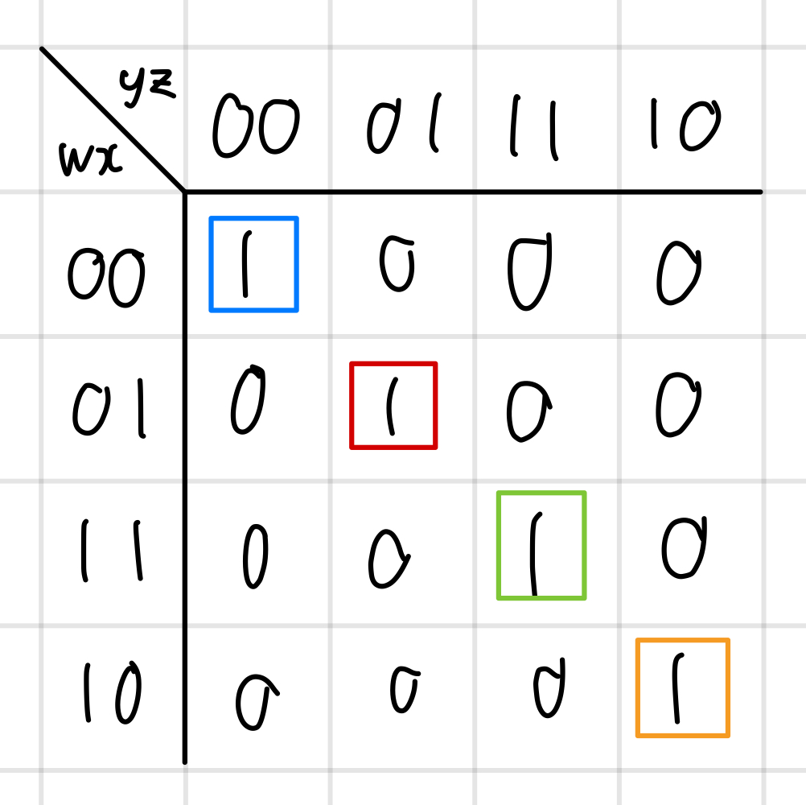
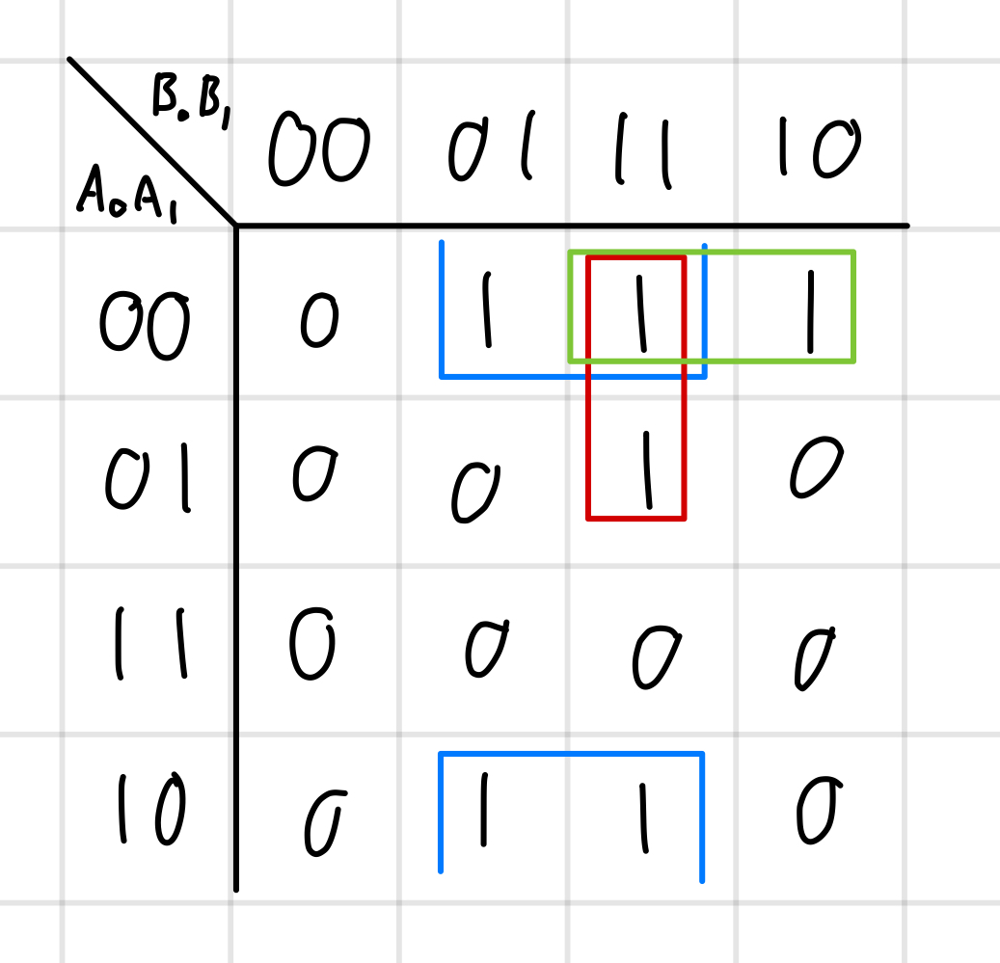
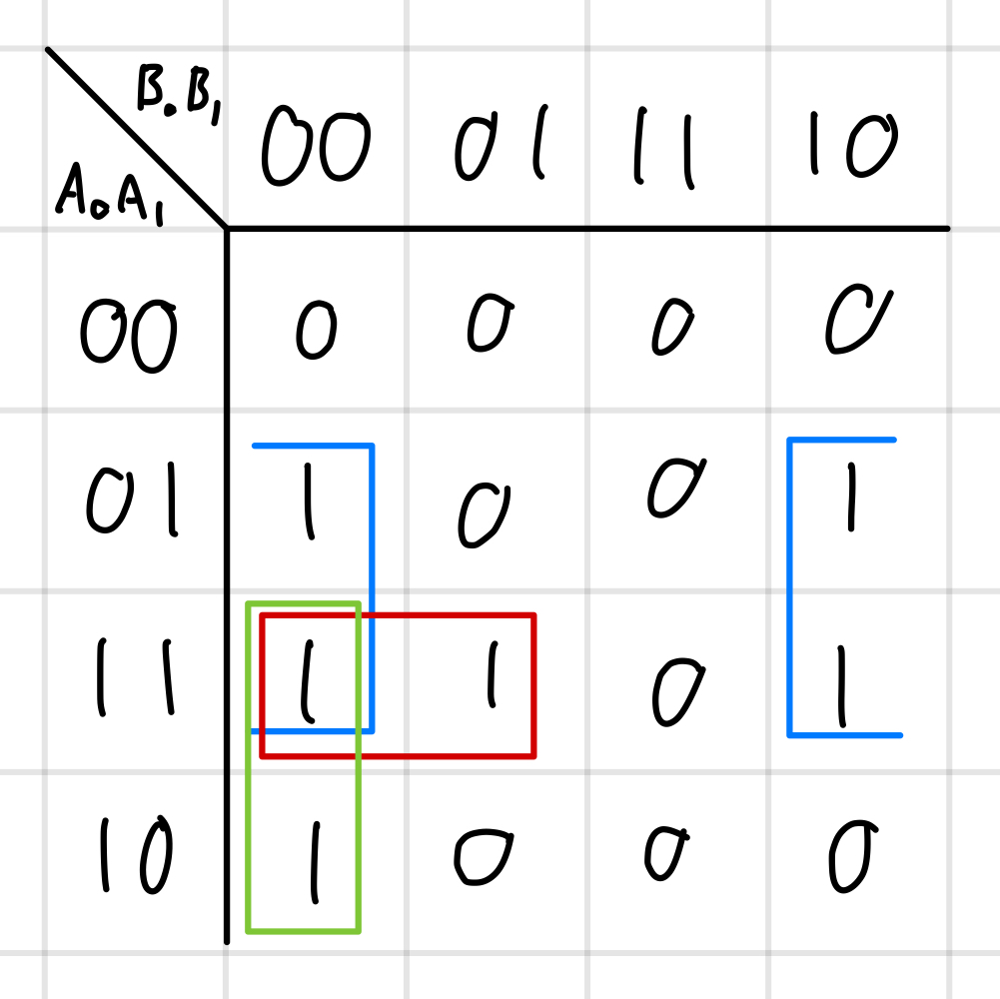
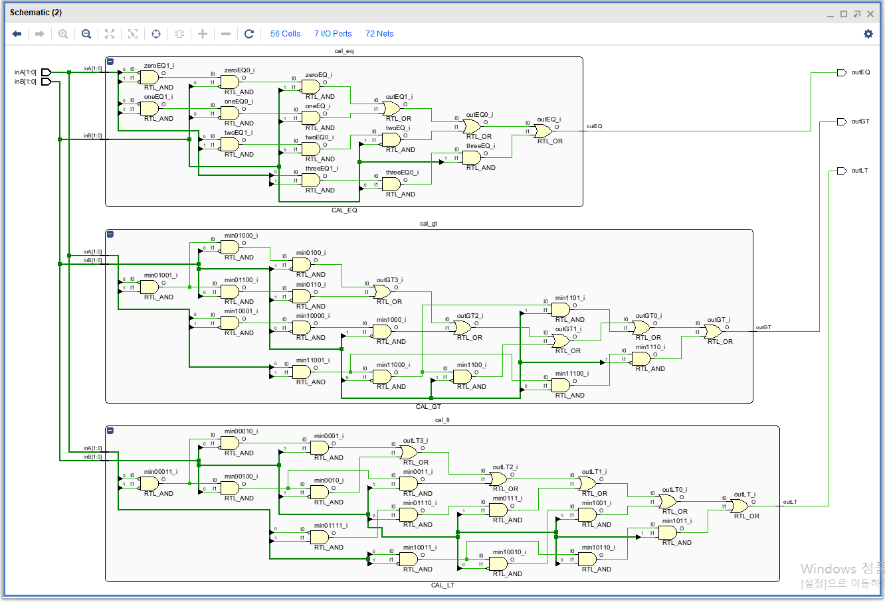
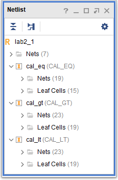
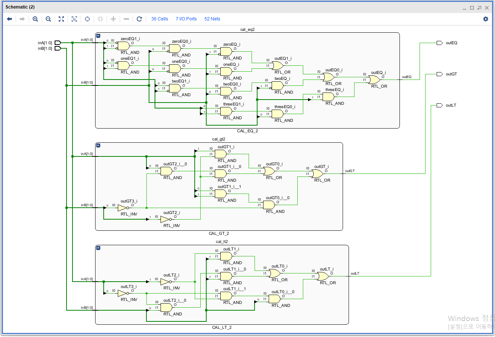
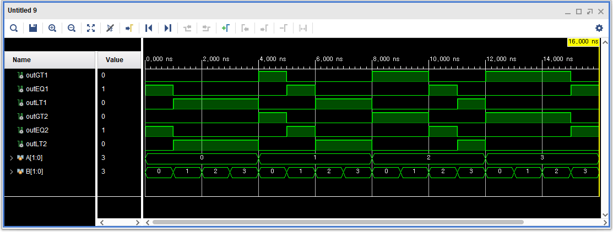

# 디지털시스템설계 Lab 2

## 개요

이 실험에서는 강의 시간에 배운 Karnaugh map 등을 이용하여 boolean expression을 단순화하는 방법과, 그 효과에 대해서 실습한다.

## 이론적 배경

### Karnaugh Map

불 대수식을 sum of products 형식으로 최대한 간단하게 표현하는 시각적인 기법이다. Karnaugh map을 사용하면 2-level circuit으로 논리 식을 나타낼 수 있다.

## 2-bit Magnitude Comparator

서로 다른 2비트 숫자 `A`, `B`가 주어졌을 때, 둘의 대소 관계를 출력하는 논리 회로이다. `A`와 `B`를 받는 입력 4개와, `A > B`, `A == B`, `A < B` 각각에 해당하는 출력 3개로 이루어져 있다.

## 실험 준비

우선 `A == B`일 때의 truth table은 다음과 같다.

| `A0` | `A1` | `B0` | `B1` | Out |
| ---- | ---- | ---- | ---- | --- |
| `0`  | `0`  | `0`  | `0`  | `1` |
| `0`  | `0`  | `0`  | `1`  | `0` |
| `0`  | `0`  | `1`  | `0`  | `0` |
| `0`  | `0`  | `1`  | `1`  | `0` |
| `0`  | `1`  | `0`  | `0`  | `0` |
| `0`  | `1`  | `0`  | `1`  | `1` |
| `0`  | `1`  | `1`  | `0`  | `0` |
| `0`  | `1`  | `1`  | `1`  | `0` |
| `1`  | `0`  | `0`  | `0`  | `0` |
| `1`  | `0`  | `0`  | `1`  | `0` |
| `1`  | `0`  | `1`  | `0`  | `1` |
| `1`  | `0`  | `1`  | `1`  | `0` |
| `1`  | `1`  | `0`  | `0`  | `0` |
| `1`  | `1`  | `0`  | `1`  | `0` |
| `1`  | `1`  | `1`  | `0`  | `0` |
| `1`  | `1`  | `1`  | `1`  | `1` |

Minterm expansion을 통해 그대로 나타낸 결과는 다음과 같다.

$$
\begin{align*}
  F(A_0, A_1, B_0, B_1) &= \sum m(0, 5, 10, 15) \\
          &= A_0' A_1' B_0' B_1' + A_0' A_1 B_0' B_1 + A_0 A_1' B_0 B_1' + A_0 A_1 B_0 B_1
\end{align*}
$$

K-map을 그려보면 다음과 같다.



모든 prime implicant가 1개의 1만 커버하기 떄문에, simplification을 더 이상 할 수 없다.

`A < B`에서의 truth table은 다음과 같다.

| `A0` | `A1` | `B0` | `B1` | Out |
| ---- | ---- | ---- | ---- | --- |
| `0`  | `0`  | `0`  | `0`  | `0` |
| `0`  | `0`  | `0`  | `1`  | `1` |
| `0`  | `0`  | `1`  | `0`  | `1` |
| `0`  | `0`  | `1`  | `1`  | `1` |
| `0`  | `1`  | `0`  | `0`  | `0` |
| `0`  | `1`  | `0`  | `1`  | `0` |
| `0`  | `1`  | `1`  | `0`  | `0` |
| `0`  | `1`  | `1`  | `1`  | `1` |
| `1`  | `0`  | `0`  | `0`  | `0` |
| `1`  | `0`  | `0`  | `1`  | `1` |
| `1`  | `0`  | `1`  | `0`  | `0` |
| `1`  | `0`  | `1`  | `1`  | `1` |
| `1`  | `1`  | `0`  | `0`  | `0` |
| `1`  | `1`  | `0`  | `1`  | `0` |
| `1`  | `1`  | `1`  | `0`  | `0` |
| `1`  | `1`  | `1`  | `1`  | `0` |

Minterm expansion을 사용하면 다음과 같다.

$$
\begin{align*}
F(A_0, A_1, B_0, B_1) &= \sum m(1, 2, 3, 7, 9, 11) \\
        &= A_0' A_1' B_0' B_1 + A_0' A_1' B_0 B_1' + A_0' A_1' B_0 B_1 + A_0' A_1 B_0 B_1 \\
        &+ A_0' A_1 B_0 B_1 + A_0 A_1' B_0 B_1
\end{align*}
$$

K-map을 그려보면 다음과 같다.



모든 prime implicant가 essential prime implicant임을 알 수 있고, 따라서 각 prime implicant들을 OR로 합쳐서 다음과 같이 simplification 결과를 쓸 수 있다.

$$
F(A_0, A_1, B_0, B_1) = A_1' B_1 + A_0' B_0 B_1 + A_0' A_1' B_0
$$

`A > B`에서의 truth table을 그리면

| `A0` | `A1` | `B0` | `B1` | Out |
| ---- | ---- | ---- | ---- | --- |
| `0`  | `0`  | `0`  | `0`  | `0` |
| `0`  | `0`  | `0`  | `1`  | `0` |
| `0`  | `0`  | `1`  | `0`  | `0` |
| `0`  | `0`  | `1`  | `1`  | `0` |
| `0`  | `1`  | `0`  | `0`  | `1` |
| `0`  | `1`  | `0`  | `1`  | `0` |
| `0`  | `1`  | `1`  | `0`  | `1` |
| `0`  | `1`  | `1`  | `1`  | `0` |
| `1`  | `0`  | `0`  | `0`  | `1` |
| `1`  | `0`  | `0`  | `1`  | `0` |
| `1`  | `0`  | `1`  | `0`  | `0` |
| `1`  | `0`  | `1`  | `1`  | `0` |
| `1`  | `1`  | `0`  | `0`  | `1` |
| `1`  | `1`  | `0`  | `1`  | `1` |
| `1`  | `1`  | `1`  | `0`  | `1` |
| `1`  | `1`  | `1`  | `1`  | `0` |

Minterm expansion을 사용하면 다음과 같다.

$$
\begin{align*}
  F(A_0, A_1, B_0, B_1) &= \sum m(4, 6, 8, 12, 13, 14) \\
          &= A_0' A_1 B_0' B_1' + A_0' A_1 B_0 B_1' + A_0 A_1' B_0' B_1' + A_0 A_1 B_0' B_1' \\
          &+ A_0 A_1 B_0' B_1 + A_0 A_1 B_0 B_1'
\end{align*}
$$

K-map을 그려보면 다음과 같다.



모든 prime implicant가 여기서도 essential prime implicant이고, 앞서와 똑같이 simplification을 하면 다음과 같이 쓸 수 있다.

$$
F(A_0, A_1, B_0, B_1) = A_1 B_1' + A_0 B_0' B_1' + A_0 A_1 B_0'
$$

## 실험 결과

Simplification을 하지 않았을 때의 schematic은 다음과 같다.



Netlist는 다음과 같다.



Simplification을 한 이후의 schematic은 다음과 같다.



Netlist는 다음과 같다.


`A == B`를 계산하는 회로는 simplification을 더 이상 할 수 없기 때문에 wire, gate 개수가 두 경우 모두 19, 15개이지만, `A < B`, `A > B`를 계산하는 회로는 simplification 이후 wire, gate 개수가 모두 각각 23, 19개에서 13, 9개로 개수가 감소한 것을 알 수 있다.

과제에 명시적으로 나와 있지는 않았지만, 간단한 테스트벤치를 작성하여 설계한 회로의 정상 작동도 확인해 보았다. 다음과 같은 테스트벤치 코드를 작성하였다.

```verilog
`timescale 1ns / 1ps

module lab2_tb();
    wire outGT1, outEQ1, outLT1, outGT2, outEQ2, outLT2;
    reg [1:0] A, B;

    lab2_1 cmp1(outGT1, outEQ1, outLT1, A, B);
    lab2_2 cmp2(outGT2, outEQ2, outLT2, A, B);

    initial begin
        A = 2'b00;
        B = 2'b00;
        #16 $finish;
    end

    always begin
        #8 A[1] <= !A[1];
    end

    always begin
        #4 A[0] <= !A[0];
    end

    always begin
        #2 B[1] <= !B[1];
    end

    always begin
        #1 B[0] <= !B[0];
    end
endmodule
```

테스트벤치를 실행해 얻은 파형은 다음과 같다.



`A`와 `B` 레지스터는 각각 0으로 시작해서 `A[1]`은 8ns, `A[0]`은 4ns, `B[1]`은 2ns, `B[0]`은 1ns마다 비트를 뒤집는 방식으로 코딩하였다. 파형에서 볼 수 있듯 `A`는 16ns를 주기로 0, 1, 2, 3을 순환하고, `B`는 4ns를 주기로 0, 1, 2, 3을 순환한다.

파형에서 나온 것과 같이, `A`와 `B`의 비교 결과가 `outGT1`, `outEQ1`, `outLT1`와 `outGT2`, `outEQ1`, `outLT1`에서 나오는 것을 알 수 있다.

## 논의

이 실험을 통해 2bit magnitude comparator를 구현하고 시뮬레이션해 볼 수 있었다. 특히 `lab2_1.v`를 작성할 때에 반복적으로 나오는 코드가 있었는데, 이 부분에서 코딩 실수가 많았다. 베릴로그 코드를 수동으로 고치는 것이 힘들어 다음과 같은 파이썬 코드를 작성하여 베릴로그 코드 생성을 자동화하는 경험도 할 수 있었다. 다음은 사용했던 코드의 일부인데, `A < B`인 경우를 처리하는 부분의 베릴로그 코드를 생성한다.

```python
import itertools

for a0, a1, b0, b1 in itertools.product(range(2), repeat=4):
    if (a1, a0) >= (b1, b0):
        continue
    minterm_id = a0 * 8 + a1 * 4 + b0 * 2 + b1
    negs = [('~', ' ')[x] for x in (a0, a1, b0, b1)]
    expr = f"{negs[0]}inA[0] & {negs[1]}inA[1] & {negs[2]}inB[0] & {negs[3]}inB[1]"
    print(f"assign min{minterm_id:04b} = {expr};")
```
